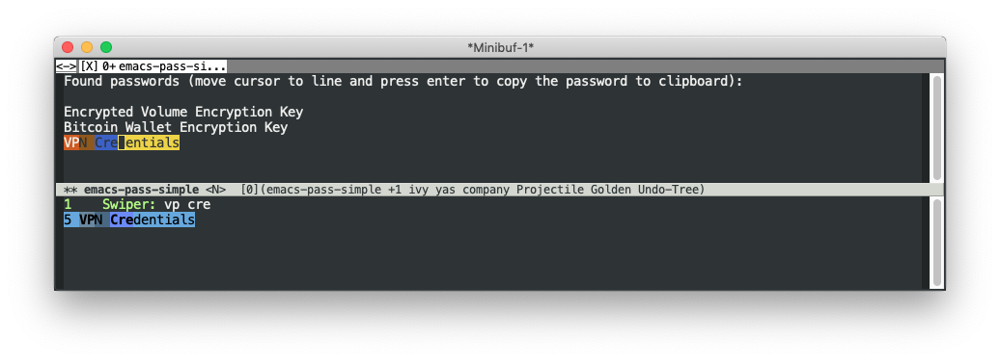

Copy pass entires to clipboard easily



OSX keybaord can be configured to launch emacs plugin. Create an automator service which runs run.sh, and bind servce to key.


Installation with quelpa: 

```
(use-package emacs-pass-simple :quelpa (emacs-pass-simple :fetcher github :repo "justintaft/emacs-pass-simple" :files ("*.el" "Emacs Pass Simple.app")))
```


OSX SSH and GPG Integration Instructions:

- Add to ~/.bash_profile to auto-start gpg agent
```
[ -f ~/.gpg-agent-info ] && source ~/.gpg-agent-info
if [ -S "${GPG_AGENT_INFO%%:*}" ]; then
    export GPG_AGENT_INFO
    export SSH_AUTH_SOCK
    export SSH_AGENT_PID
else
    eval $( gpg-agent --daemon --write-env-file ~/.gpg-agent-info )
fi
```

- Install GPG Tools 

- Add the following ~/.gnupg/gpg-agent.conf to allow ssh access. External pinentry program currently required.

```
default-cache-ttl 600
max-cache-ttl 7200
enable-ssh-support
write-env-file ~/.gpg-agent-info
pinentry-program /usr/local/MacGPG2/libexec/pinentry-mac.app/Contents/MacOS/pinentry-mac
```


- Restart GPG Agent

```
killall gpg-agent
eval $( gpg-agent --daemon --write-env-file ~/.gpg-agent-info )
source ~/.gpg-agent-info
```

References: https://www.linode.com/docs/security/authentication/gpg-key-for-ssh-authentication/ 


- Fix apple events errors

tccutil reset AppleEvents
